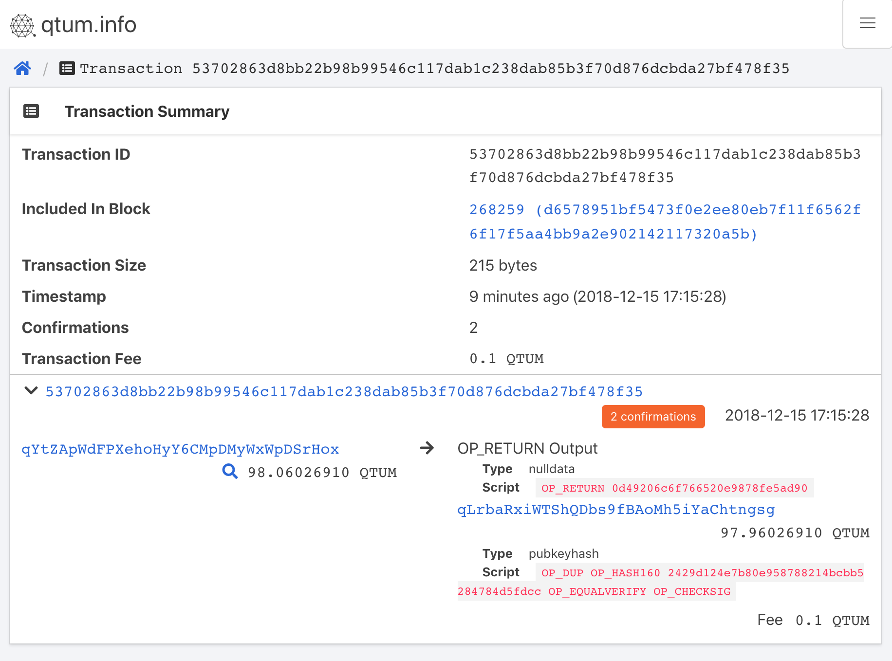

# qtum-opreturn
A demo for storing data on Qtum using OP_RETURN

# How to use
1. Download the code and install dependencies.
```
$ git clone https://github.com/qtumproject/qtum-opreturn.git
$ cd qtum-opreturn
$ npm install
```

2. Start a Qtum node and make sure there are some coins in the wallet.
```
qtumd -rpcuser=qtum -rpcpassword=opreturn -testnet -daemon
```

3. Send text to Qtum using OP_RETURN.
```
$ node send.js --help

Usage: send.js [options]

	--help, -h
		Displays help information about this script
		'send.js -h' or 'send.js --help'

	--rpcuser
		Username for JSON-RPC connections of Qtum

	--rpcpassword
		Password for JSON-RPC connections of Qtum

	--rpcport
		Port for JSON-RPC connections of Qtum

	--gas
		Gas used to pay the transaction

	--msg
		Message to be sent, no more than 80 byte

$ node send.js --msg="I love 量子"
Options are:
{ rpcuser: 'qtum',
  rpcpassword: 'opreturn',
  rpcport: '13889',
  gas: 0.1,
  msg: 'I love 量子',
  msgHexStr: '49206c6f766520e9878fe5ad90' }
Transaction is:
'53702863d8bb22b98b99546c117dab1c238dab85b3f70d876dcbda27bf478f35'
```

4. Show recent OP_RETURN transactions.
```
$ node show.js --help

Usage: show.js [options]

	--help, -h
		Displays help information about this script
		'show.js -h' or 'show.js --help'

	--rpcuser
		Username for JSON-RPC connections of Qtum

	--rpcpassword
		Password for JSON-RPC connections of Qtum

	--rpcport
		Port for JSON-RPC connections of Qtum

	--number
		Number of blocks go through

$ node show.js
Options are:
{ rpcuser: 'qtum',
  rpcpassword: 'opreturn',
  rpcport: '13889',
  number: 100 }
{ txid:
   '53702863d8bb22b98b99546c117dab1c238dab85b3f70d876dcbda27bf478f35',
  vout: 0,
  script: 'OP_RETURN 49206c6f766520e9878fe5ad90',
  text: 'I love 量子' }
```

5. The transaction is also shown in https://testnet.qtum.info/tx/53702863d8bb22b98b99546c117dab1c238dab85b3f70d876dcbda27bf478f35
